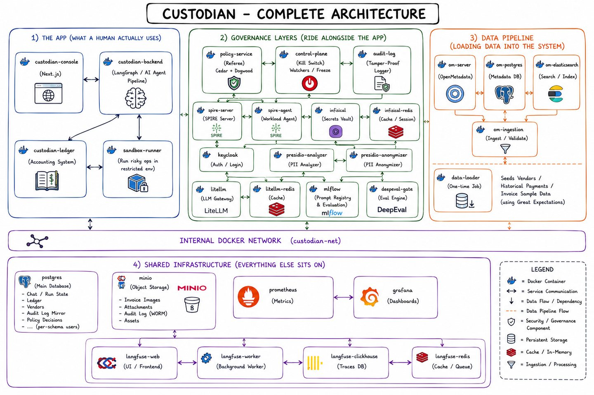
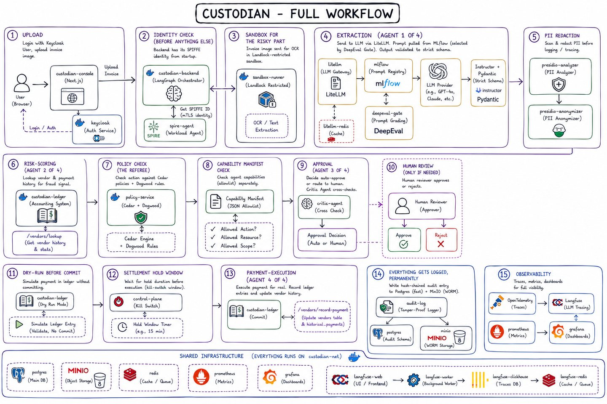
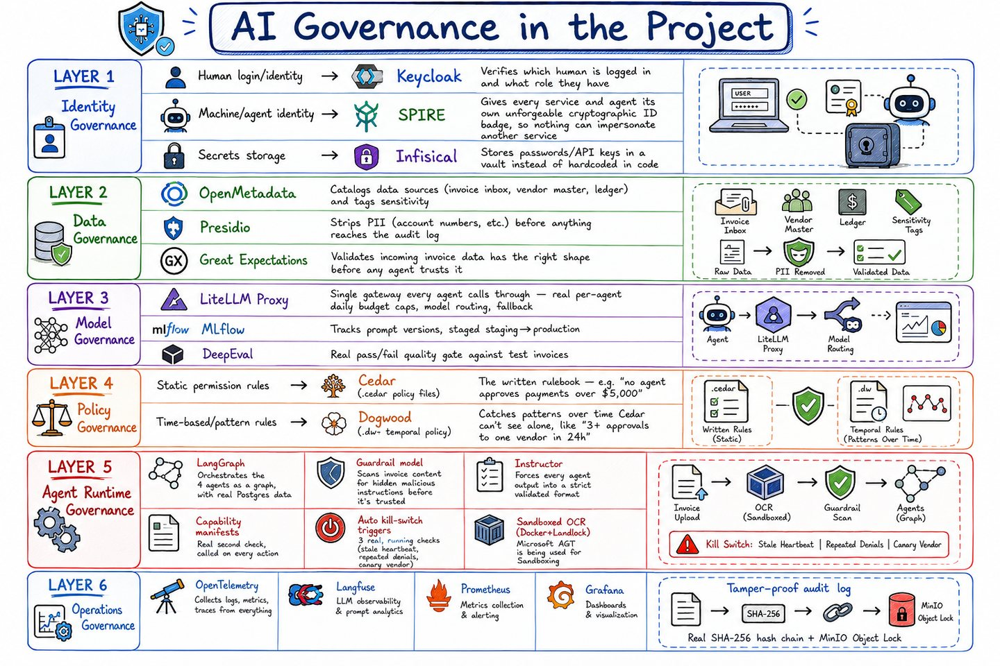

# Custodian

**In one sentence:** a team of AI agents reads invoices, decides whether
they look safe to pay, and pays the safe ones automatically — while a
separate set of guardrails watches everything the agents do and can prove,
after the fact, exactly what happened and why.

More precisely: a governed multi-agent finance operations platform —
autonomous invoice extraction, fraud/risk scoring, approval routing, and
vendor payment execution, wrapped in six real governance layers (Identity,
Data, Model, Policy, Agent Runtime, Operations). See
[`INSTRUCTIONS.md`](INSTRUCTIONS.md) for the full specification this build
satisfies.

[Architecture](#architecture) · [Invoice workflow](#invoice-workflow) ·
[Tech stack](#tech-stack) · [Documentation](#documentation) ·
[Setup](#1-prerequisites)

## Architecture

Custodian separates the operator console and agent pipeline from the services
that authorize actions, broker credentials, record evidence, and stop execution.
Docker Compose runs these components on the shared `custodian-net` network.
Payment execution posts balanced entries to the project's own ledger; it does
not initiate an external bank transfer.

[](docs/readme-assets/complete-architecture.jpg)

*Plate 56, “Complete architecture,” extracted from the
[Custodian Visual Guide](docs/Custodian-Visual-Guide.docx). Click any diagram to
open it at full size. These are conceptual illustrations; the descriptions below
reflect the checked-in implementation.*

| Component | Responsibility |
| --- | --- |
| [`custodian-console`](custodian-console/) | Invoice submission, run status, human approvals, audit verification, ledger views, and operational controls. |
| [`custodian-backend`](custodian-backend/) | FastAPI service hosting the four-agent LangGraph workflow, with PostgreSQL checkpoints for pause and resume. |
| [`policy-service`](infra/policy-service/) | Cedar authorization and temporal checks over recorded decisions, alongside the agents' separate capability checks. |
| [`custodian-ledger`](custodian-ledger/) | Vendor-history lookup, payment dry-runs, balanced ledger commits, and duplicate protection by invoice ID. |
| [`custodian-control-plane`](custodian-control-plane/) | Independent process for heartbeats, automatic stop triggers, and global, agent, session, or tool freezes. |
| [`custodian-audit-log`](custodian-audit-log/) | SHA-256 hash chain, MinIO Object Lock storage, PostgreSQL query mirror, and integrity verification. |
| [`custodian-sandbox-runner`](custodian-sandbox-runner/) | Starts a disposable OCR container with network, filesystem, user, and resource restrictions. |
| [`custodian-data-loader`](custodian-data-loader/) | Loads invoice samples and vendor/payment history, and reports data-quality results. |

## Invoice workflow

[](docs/readme-assets/invoice-workflow.jpg)

*Plate 57, “Full workflow,” from the Visual Guide. Model names and hold times
inside the illustration are examples; runtime settings live in the source and
Compose configuration.*

1. **Submit and inspect.** A user signs in through Keycloak and submits invoice
   text or an image. Images take the isolated OCR path; a guardrail model checks
   invoice text for unsafe instructions before field extraction.
2. **Extract and assess risk.** Extraction returns structured invoice fields.
   Risk-Scoring consults stored vendor and payment history, rather than trusting
   an invoice's claim that its vendor is already known.
3. **Authorize and review.** Capability manifests and policy checks constrain
   agent actions. Approval applies a confidence threshold and calls a critic
   through a different provider before auto-approval. Risk or approval escalation
   pauses the graph for human review; rejection ends the run.
4. **Validate and settle.** Payment-Execution alone has the ledger-write
   capability. It fetches the ledger credential through Infisical, performs a
   dry-run, waits through the configured settlement hold, and re-checks the kill
   switch before committing. The ledger rejects reuse of the same invoice ID.
5. **Record and observe.** The audit service stores evidence for integrity
   verification, OpenTelemetry exports model-call traces to Langfuse, and
   Prometheus feeds the Grafana dashboards.

See the [implementation flow diagram](docs/architecture-diagrams/B03-agent-orchestration.png)
for the exact graph branches and [settlement diagram](docs/architecture-diagrams/B08-settlement.png)
for dry-run and commit behavior.

## Tech stack

The six governance layers surround the application workflow. Each layer has a
specific responsibility, from identifying the caller to checking a payment and
retaining evidence of the decision.

[](docs/readme-assets/governance-layers.jpg)

*Plate 7, “The six governance layers,” from the Visual Guide. The table records
how those tools are used in this repository.*

| Area | Technologies | Role in Custodian |
| --- | --- | --- |
| Web console | Next.js, React, TypeScript, Tailwind CSS, NextAuth.js | Operator UI and Keycloak-backed login. |
| Backend and orchestration | Python 3.12, FastAPI, Uvicorn, LangGraph, PostgreSQL checkpointer | API services, agent routing, durable run state, and human interrupts. |
| Identity governance | Keycloak, SPIFFE/SPIRE, Infisical | Human roles, workload identity, and credential brokering for ledger access. |
| Data governance | OpenMetadata, Microsoft Presidio, Great Expectations, pandas, Hugging Face datasets | Cataloging and sensitivity tags, audit-text redaction, and batch validation of SROIE/CORD and USAspending data. |
| Model governance | LiteLLM, OpenAI, Groq, MLflow, DeepEval | Scoped model routes and budgets, prompt artifacts, evaluation, and promotion. |
| Policy governance | Cedar via `cedarpy`, Dogwood `.dw` specification, Python, PostgreSQL | Request authorization plus a rolling vendor-approval limit enforced in Python against the decision log. |
| Agent runtime governance | Instructor, Pydantic, JSON capability manifests, Tesseract, Docker, Agent Governance Toolkit, Landlock | Structured outputs, action allowlists, guardrail and critic checks, and isolated OCR. |
| Operations governance | OpenTelemetry, Langfuse, Prometheus, Grafana, custom control plane | Model-call traces, metrics, dashboards, heartbeats, and kill-switch enforcement. |
| Storage and deployment | PostgreSQL, SQLAlchemy, MinIO Object Lock, Redis, ClickHouse, Elasticsearch, Docker Compose | Ledger and service databases, audit objects, caches, trace storage, catalog search, and service deployment. |

**Implementation details.** The four agents share one backend process and its
SPIRE identity; Cedar and capability manifests provide per-agent action
separation. Great Expectations reports batch quality results without blocking
the load. Presidio redacts selected audit text, not every stored or traced field,
and currently returns the original text if the redaction service is unavailable.
The OCR path requires a Landlock-capable Linux kernel; see [Status](#status) for
the Docker Desktop limitation.

Dependency versions are recorded in the console's
[`package.json`](custodian-console/package.json), each service's
`requirements.txt`, and [`infra/compose/`](infra/compose/). Model routes and
fallbacks are defined in [`infra/litellm/config.yaml`](infra/litellm/config.yaml).

---

## Documentation

**Start here → [Final Project Document](Custodian-Final-Project-Document.docx)**
— an 11-page overview covering the end-to-end workflow, architecture diagrams,
tech stack, governance controls, screenshots, setup, validation results, and
implementation limits.

| Document | What it covers |
| --- | --- |
| [Final Project Document](Custodian-Final-Project-Document.docx) | Publication edition: the complete project explained in 11 pages with nine figures and source references. |
| [Project Reference](https://claude.ai/code/artifact/c2d3ea16-4707-474c-a0a3-8ac49fc19d1f) | Additional architecture, pipeline, governance, setup, and validation reference. |
| [Visual Guide](https://claude.ai/code/artifact/00c68da3-d652-4bfb-a7c4-96dd60537a9a) | All 57 plates from the project whiteboard — hand-drawn explainers and live screenshots, captioned and grouped by governance layer. Best for learning the system from scratch. |
| [Field Guide](https://claude.ai/code/artifact/95482b5c-8532-4491-aab7-d6844a1dcba6) | Architecture and pipeline walkthrough with live console evidence from a real settled run. |
| [`docs/Custodian-Scenario-Validation-Report.docx`](docs/Custodian-Scenario-Validation-Report.docx) | All 20 scenarios executed against a live instance — results, screenshots and 8 findings. |
| [`docs/Custodian-Visual-Guide.docx`](docs/Custodian-Visual-Guide.docx) | The whiteboard as a Word document, with an explanation per plate. |
| [`docs/scenarios/`](docs/scenarios/) | Runnable walkthroughs — try each guardrail yourself. |
| [`CREDENTIALS.md`](CREDENTIALS.md) | Every browser-facing UI and how to log into it. |
| [`INSTRUCTIONS.md`](INSTRUCTIONS.md) | The specification this build satisfies. |

[`Custodial.png`](Custodial.png) in the repo root is another full platform
architecture view. The three embedded diagrams above are copied directly from
the Word Visual Guide; their [source plate mapping](docs/readme-assets/README.md)
is included alongside the images.

### Status

All 20 documented scenarios pass against a live instance, with one partial:
the Landlock sandbox layer cannot run on Docker Desktop for macOS or Windows,
because its LinuxKit kernel ships without `CONFIG_SECURITY_LANDLOCK`. The OCR
entrypoint refuses to run unsandboxed rather than degrade silently, so
**image upload does not work on those hosts** — text submission is unaffected.
See the Project Reference for the full gap list.

---

## 1. Prerequisites

- **Docker Desktop**, recent stable release, WSL2 backend on Windows.
- **RAM: 20GB allocated to Docker Desktop's VM, minimum.** This stack runs
  Keycloak, SPIRE, Infisical, OpenMetadata (Postgres + Elasticsearch +
  Airflow-based ingestion), Presidio, LiteLLM, MLflow, Langfuse (its own
  ClickHouse + Redis), Prometheus, Grafana, and the full agent runtime
  simultaneously — measured steady-state usage across this build is
  ~9-10GB, but headroom matters during builds and OpenMetadata's JVM startup.
  On Windows, raise the ceiling in `%UserProfile%\.wslconfig`:
  ```ini
  [wsl2]
  memory=20GB
  processors=8
  ```
  then `wsl --shutdown` and restart Docker Desktop.
- **Disk:** ~25GB free for images alone.
- **CPU:** 6+ cores recommended (8 used throughout this build).
- A POSIX shell for the bootstrap scripts (`sh`) — Git Bash on Windows
  works; every script under `infra/scripts/` is plain `#!/bin/sh`.

## 2. Getting the two API keys

Custodian calls two real LLM providers through LiteLLM — there is no offline
or mocked model path.

- **OpenAI** (`custodian-reasoning` route, `gpt-5.6-sol`): create a key at
  https://platform.openai.com/api-keys. Needs standard chat-completions
  access; no special tier required for this workload's volume.
- **Groq** (`custodian-routine` and `custodian-guardrail` routes,
  `openai/gpt-oss-120b` and `openai/gpt-oss-safeguard-20b`): create a key at
  https://console.groq.com/keys.

```sh
cp .env.example .env
```
`.env.example` already has a real random value filled in for every
local-only secret — open `.env` and change just these two lines:

```
OPENAI_API_KEY=sk-...
GROQ_API_KEY=gsk_...
```

`.env` is gitignored — never commit it. Everything else in it either
already has a working value, or gets filled in automatically by a setup
script later in §3.


### Step 0 — one-time setup
```sh
docker network create custodian-net
```
Creates a private virtual network inside Docker so all the Custodian containers can find and talk to each other by name 

---


```sh
sh infra/scripts/render-keycloak-realm.sh
```
Fills in the Keycloak login system's config file with real passwords from your .env, so Keycloak starts up already set up instead of empty.

---

### Step 1 — Foundations (shared database + file storage)

```sh
sh infra/scripts/compose.sh up -d postgres minio
```

Starts the shared database (Postgres) and file storage (MinIO) in the background

---

### Step 2 — Identity (logins, secrets, service identities)

```sh
sh infra/scripts/compose.sh up -d keycloak spire-server infisical-redis infisical
```

Starts the login system (Keycloak), the identity-issuing service (SPIRE), and the secrets vault (Infisical) in the background.

---

```sh
sh infra/scripts/register-spire-entries.sh
```
Registers the 4 AI agents (plus the backend itself) with SPIRE, so it knows how to recognize each one and issue it a real ID.

---

```sh
sh infra/scripts/setup-spire.sh
sh infra/scripts/compose.sh up -d --force-recreate spire-agent
```
First command generates a one-time "invite code" (join token) SPIRE needs and saves it to .env; second command restarts the SPIRE agent so it picks up that token and gets its identity.

---


```sh
sh infra/scripts/bootstrap-infisical.sh
python3 infra/scripts/provision-infisical-identities.py
```
First command creates the vault's admin account. Second command creates a login for each service and stores your real passwords/keys inside the vault — it'll print some values you need to copy into .env.

**The second command prints values you need to copy into `.env`** —
`INFISICAL_PROJECT_ID`, `PAYMENT_EXECUTION_CLIENT_ID`,
`PAYMENT_EXECUTION_CLIENT_SECRET`. Paste them in now.

---

### Step 3 — Data (real invoice + vendor datasets)

```sh
sh infra/scripts/compose.sh up -d om-postgres om-elasticsearch om-migrate om-server om-ingestion presidio-analyzer presidio-anonymizer
```
Starts the data catalog system (OpenMetadata, which tags sensitive data) and Presidio (which detects personal info like emails or account numbers) in the background.

---

```sh
sh infra/scripts/compose.sh up data-loader
```

Downloads real invoice data and real vendor/payment data from public sources(SROIE, CORD) and real U.S. government and loads them into the database — takes a couple minutes

---


```sh
python3 infra/scripts/register-openmetadata-catalog.py
```
Marks the newly-loaded tables in the data catalog as "contains sensitive data," so the system knows to treat them carefully.

---

### Step 4 — Model (the AI gateway + prompt quality gate)

```sh
sh infra/scripts/compose.sh up -d litellm-redis litellm mlflow
```

Starts LiteLLM (the single gateway all AI calls go through) and MLflow (which tracks which prompt versions are good enough to use) in the background.

```sh
curl http://localhost:4000/health/liveliness
```
Empty response means it's still migrating - just re-run the same command
again until you see a real reply.

```sh
python3 infra/scripts/provision-litellm-keys.py
```

Creates a separate AI-access key for each agent, each with its own spending limit — it'll print values you need to copy into .env

---


```sh
sh infra/scripts/compose.sh up deepeval-gate
```

Runs a real grading test on two versions of the invoice-reading prompt — the good one gets approved for use, the bad one gets blocked. Takes a few minutes.

---

### Step 5 — Policy (check the rulebook is valid)

```sh
python3 infra/scripts/validate-cedar-policies.py
```

Checks that the real approval rulebook (Cedar policies) is written correctly and makes the right decisions — should print ACCEPTED with no errors.

---

### Step 6 — Agent runtime + everything else

```sh
sh infra/scripts/compose.sh up -d
```

Starts everything else at once — the AI agents, the ledger, the policy checker, the audit log, the kill switch, the web console, and the dashboards.

---


```sh
docker build -t custodian-sandbox-ocr:latest custodian-sandbox-ocr/
```

Builds the locked-down sandbox image used to safely read scanned invoice images — without this, uploading an invoice photo won't work..

---

### Confirm everything is up

```sh
sh infra/scripts/compose.sh ps --format "table {{.Name}}\t{{.Status}}"
```

Lists every running container and its status, so you can check that everything shows healthy before moving on.

---

### Opening all the UI Components

See [`CREDENTIALS.md`](CREDENTIALS.md) for UI addresses and demo logins.
